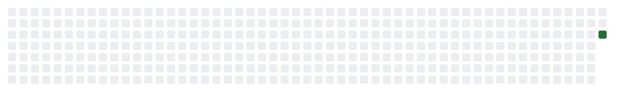

### 📅 최근 1년 풀이 현황 (총 55문제)

| 사이트 | 문제번호 | 난이도 | 알고리즘 | 제목 | 언어 | 풀이 날짜 |
| :---: | :---: | :---: | :---: | :--- | :---: | :---: |
| 백준 | 1018 | 실버3 | 구현 | [체스판 다시 칠하기](%EB%B0%B1%EC%A4%80%28%EA%B5%AC%ED%98%84%5E%EC%8B%A4%EB%B2%843%29%EC%B2%B4%EC%8A%A4%ED%8C%90_%EB%8B%A4%EC%8B%9C_%EC%B9%A0%ED%95%98%EA%B8%B0%5E1018.py) | Python | 2026-01-27 |
| 백준 | 1181 | 실버4 | 정렬 | [단어 정렬](%EB%B0%B1%EC%A4%80%28%EC%A0%95%EB%A0%AC%5E%EC%8B%A4%EB%B2%844%29%EB%8B%A8%EC%96%B4_%EC%A0%95%EB%A0%AC%5E1181.py) | Python | 2026-01-27 |
| 백준 | 1244 | 실버4 | 구현 | [스위치 켜고 끄기](%EB%B0%B1%EC%A4%80%28%EA%B5%AC%ED%98%84%5E%EC%8B%A4%EB%B2%844%29%EC%8A%A4%EC%9C%84%EC%B9%98%20%EC%BC%9C%EA%B3%A0%20%EB%81%84%EA%B8%B0%5E1244.py) | Python | 2026-01-27 |
| 백준 | 1764 | 실버4 | 맵 | [듣보잡](%EB%B0%B1%EC%A4%80%28%EB%A7%B5%5E%EC%8B%A4%EB%B2%844%29%EB%93%A3%EB%B3%B4%EC%9E%A1%5E1764.py) | Python | 2026-01-27 |
| 백준 | 1874 | 실버2 | 스택 | [스택 수열](%EB%B0%B1%EC%A4%80%28%EC%8A%A4%ED%83%9D%5E%EC%8B%A4%EB%B2%842%29%EC%8A%A4%ED%83%9D_%EC%88%98%EC%97%B4%5E1874.py) | Python | 2026-01-27 |
| 백준 | 1920 | 실버4 | 맵 | [수 찾기](%EB%B0%B1%EC%A4%80%28%EB%A7%B5%5E%EC%8B%A4%EB%B2%844%29%EC%88%98_%EC%B0%BE%EA%B8%B0%5E1920.py) | Python | 2026-01-27 |
| 백준 | 1927 | 실버2 | 힙 | [최소 힙](%EB%B0%B1%EC%A4%80%28%ED%9E%99%5E%EC%8B%A4%EB%B2%842%29%EC%B5%9C%EC%86%8C_%ED%9E%99%5E1927.py) | Python | 2026-01-27 |
| 백준 | 2164 | 실버4 | 큐 | [카드2](%EB%B0%B1%EC%A4%80%28%ED%81%90%5E%EC%8B%A4%EB%B2%844%29%EC%B9%B4%EB%93%9C2%5E2164.py) | Python | 2026-01-27 |
| 백준 | 2477 | 실버2 | 구현 | [참외밭](%EB%B0%B1%EC%A4%80%28%EA%B5%AC%ED%98%84%5E%EC%8B%A4%EB%B2%842%29%EC%B0%B8%EC%99%B8%EB%B0%AD%5E2477.py) | Python | 2026-01-27 |
| 백준 | 2491 | 실버4 | DP | [수열](%EB%B0%B1%EC%A4%80%28DP%5E%EC%8B%A4%EB%B2%844%29%EC%88%98%EC%97%B4%5E2491.py) | Python | 2026-01-27 |
| 백준 | 2493 | 골드5 | 스택 | [탑](%EB%B0%B1%EC%A4%80%28%EC%8A%A4%ED%83%9D%5E%EA%B3%A8%EB%93%9C5%29%ED%83%91%5E2493.py) | Python | 2026-01-27 |
| 백준 | 2504 | 골드5 | 스택 | [괄호의 값](%EB%B0%B1%EC%A4%80%28%EC%8A%A4%ED%83%9D%5E%EA%B3%A8%EB%93%9C5%29%EA%B4%84%ED%98%B8%EC%9D%98_%EA%B0%92%5E2504.py) | Python | 2026-01-27 |
| 백준 | 2559 | 실버3 | 슬라이딩_윈도우 | [수열](%EB%B0%B1%EC%A4%80%28%EC%8A%AC%EB%9D%BC%EC%9D%B4%EB%94%A9_%EC%9C%88%EB%8F%84%EC%9A%B0%5E%EC%8B%A4%EB%B2%843%29%EC%88%98%EC%97%B4%5E2559.py) | Python | 2026-01-27 |
| 백준 | 2559 | 실버3 | 구현 | [수열](%EB%B0%B1%EC%A4%80%28%EA%B5%AC%ED%98%84%5E%EC%8B%A4%EB%B2%843%29%EC%88%98%EC%97%B4%5E2559.py) | Python | 2026-01-27 |
| 백준 | 2563 | 실버5 | 구현 | [색종이](%EB%B0%B1%EC%A4%80%28%EA%B5%AC%ED%98%84%5E%EC%8B%A4%EB%B2%845%29%EC%83%89%EC%A2%85%EC%9D%B4%5E2563.py) | Python | 2026-01-27 |
| 백준 | 2578 | 실버4 | 구현 | [빙고](%EB%B0%B1%EC%A4%80%28%EA%B5%AC%ED%98%84%5E%EC%8B%A4%EB%B2%844%29%EB%B9%99%EA%B3%A0%5E2578.py) | Python | 2026-01-27 |
| 백준 | 2605 | 브론즈2 | 구현 | [줄 세우기](%EB%B0%B1%EC%A4%80%28%EA%B5%AC%ED%98%84%5E%EB%B8%8C%EB%A1%A0%EC%A6%882%29%EC%A4%84%20%EC%84%B8%EC%9A%B0%EA%B8%B0%5E2605.py) | Python | 2026-01-27 |
| 백준 | 2609 | 브론즈1 | 수학 | [최대공약수와 최소공배수](%EB%B0%B1%EC%A4%80%28%EC%88%98%ED%95%99%5E%EB%B8%8C%EB%A1%A0%EC%A6%881%29%EC%B5%9C%EB%8C%80%EA%B3%B5%EC%95%BD%EC%88%98%EC%99%80_%EC%B5%9C%EC%86%8C%EA%B3%B5%EB%B0%B0%EC%88%98%5E2609.py) | Python | 2026-01-27 |
| 백준 | 2628 | 실버5 | 구현 | [종이자르기](%EB%B0%B1%EC%A4%80%28%EA%B5%AC%ED%98%84%5E%EC%8B%A4%EB%B2%845%29%EC%A2%85%EC%9D%B4%EC%9E%90%EB%A5%B4%EA%B8%B0%5E2628.py) | Python | 2026-01-27 |
| 백준 | 2630 | 실버2 | 분할정복 | [색종이 만들기](%EB%B0%B1%EC%A4%80%28%EB%B6%84%ED%95%A0%EC%A0%95%EB%B3%B5%5E%EC%8B%A4%EB%B2%842%29%EC%83%89%EC%A2%85%EC%9D%B4_%EB%A7%8C%EB%93%A4%EA%B8%B0%5E2630.py) | Python | 2026-01-27 |
| 백준 | 2669 | 실버5 | 구현 | [직사각형 네게의 합집합의 면적 구하기](%EB%B0%B1%EC%A4%80%28%EA%B5%AC%ED%98%84%5E%EC%8B%A4%EB%B2%845%29%EC%A7%81%EC%82%AC%EA%B0%81%ED%98%95%20%EB%84%A4%EA%B2%8C%EC%9D%98%20%ED%95%A9%EC%A7%91%ED%95%A9%EC%9D%98%20%EB%A9%B4%EC%A0%81%20%EA%B5%AC%ED%95%98%EA%B8%B0%5E2669.py) | Python | 2026-01-27 |
| 백준 | 2751 | 실버5 | 정렬 | [수 정렬하기 2](%EB%B0%B1%EC%A4%80%28%EC%A0%95%EB%A0%AC%5E%EC%8B%A4%EB%B2%845%29%EC%88%98_%EC%A0%95%EB%A0%AC%ED%95%98%EA%B8%B0_2%5E2751.py) | Python | 2026-01-27 |
| 백준 | 2775 | 브론즈1 | 수학 | [부녀회장이 될테야](%EB%B0%B1%EC%A4%80%28%EC%88%98%ED%95%99%5E%EB%B8%8C%EB%A1%A0%EC%A6%881%29%EB%B6%80%EB%85%80%ED%9A%8C%EC%9E%A5%EC%9D%B4_%EB%90%A0%ED%85%8C%EC%95%BC%5E2775.py) | Python | 2026-01-27 |
| 백준 | 2798 | 브론즈2 | 완전탐색 | [블랙잭](%EB%B0%B1%EC%A4%80%28%EC%99%84%EC%A0%84%ED%83%90%EC%83%89%5E%EB%B8%8C%EB%A1%A0%EC%A6%882%29%EB%B8%94%EB%9E%99%EC%9E%AD%5E2798.py) | Python | 2026-01-27 |
| 백준 | 2805 | 실버2 | 이진탐색 | [나무자르기](%EB%B0%B1%EC%A4%80%28%EC%9D%B4%EC%A7%84%ED%83%90%EC%83%89%5E%EC%8B%A4%EB%B2%842%29%EB%82%98%EB%AC%B4%EC%9E%90%EB%A5%B4%EA%B8%B0%5E2805.py) | Python | 2026-01-27 |
| 백준 | 3015 | 플래티넘5 | 스택 | [오아시스 재결합](%EB%B0%B1%EC%A4%80%28%EC%8A%A4%ED%83%9D%5E%ED%94%8C%EB%9E%98%ED%8B%B0%EB%84%985%29%EC%98%A4%EC%95%84%EC%8B%9C%EC%8A%A4_%EC%9E%AC%EA%B2%B0%ED%95%A9%5E3015.py) | Python | 2026-01-27 |
| 백준 | 3986 | 실버4 | 스택 | [좋은 단어](%EB%B0%B1%EC%A4%80%28%EC%8A%A4%ED%83%9D%5E%EC%8B%A4%EB%B2%844%29%EC%A2%8B%EC%9D%80_%EB%8B%A8%EC%96%B4%5E3986.py) | Python | 2026-01-27 |
| 백준 | 4153 | 브론즈3 | 수학 | [직각삼각형](%EB%B0%B1%EC%A4%80%28%EC%88%98%ED%95%99%5E%EB%B8%8C%EB%A1%A0%EC%A6%883%29%EC%A7%81%EA%B0%81%EC%82%BC%EA%B0%81%ED%98%95%5E4153.py) | Python | 2026-01-27 |
| 백준 | 4673 | 실버5 | 완전탐색 | [셀프넘버](%EB%B0%B1%EC%A4%80%28%EC%99%84%EC%A0%84%ED%83%90%EC%83%89%5E%EC%8B%A4%EB%B2%845%29%EC%85%80%ED%94%84%EB%84%98%EB%B2%84%5E4673.py) | Python | 2026-01-27 |
| 백준 | 6198 | 골드5 | 스택 | [옥상 정원 꾸미기](%EB%B0%B1%EC%A4%80%28%EC%8A%A4%ED%83%9D%5E%EA%B3%A8%EB%93%9C5%29%EC%98%A5%EC%83%81_%EC%A0%95%EC%9B%90_%EA%BE%B8%EB%AF%B8%EA%B8%B0%5E6198.py) | Python | 2026-01-27 |
| 백준 | 9012 | 실버4 | 스택 | [괄호](%EB%B0%B1%EC%A4%80%28%EC%8A%A4%ED%83%9D%5E%EC%8B%A4%EB%B2%844%29%EA%B4%84%ED%98%B8%5E9012.py) | Python | 2026-01-27 |
| 백준 | 10157 | 실버3 | 구현 | [자리배정](%EB%B0%B1%EC%A4%80%28%EA%B5%AC%ED%98%84%5E%EC%8B%A4%EB%B2%843%29%EC%9E%90%EB%A6%AC%EB%B0%B0%EC%A0%95%5E10157.py) | Python | 2026-01-27 |
| 백준 | 10158 | 실버3 | 수학 | [개미](%EB%B0%B1%EC%A4%80%28%EC%88%98%ED%95%99%5E%EC%8B%A4%EB%B2%843%29%EA%B0%9C%EB%AF%B8%5E10158.py) | Python | 2026-01-27 |
| 백준 | 10163 | 브론즈1 | 구현 | [색종이](%EB%B0%B1%EC%A4%80%28%EA%B5%AC%ED%98%84%5E%EB%B8%8C%EB%A1%A0%EC%A6%881%29%EC%83%89%EC%A2%85%EC%9D%B4%5E10163.py) | Python | 2026-01-27 |
| 백준 | 10799 | 실버2 | 스택 | [쇠막대기](%EB%B0%B1%EC%A4%80%28%EC%8A%A4%ED%83%9D%5E%EC%8B%A4%EB%B2%842%29%EC%87%A0%EB%A7%89%EB%8C%80%EA%B8%B0%5E10799.py) | Python | 2026-01-27 |
| 백준 | 10814 | 실버5 | 정렬 | [나이순 정렬](%EB%B0%B1%EC%A4%80%28%EC%A0%95%EB%A0%AC%5E%EC%8B%A4%EB%B2%845%29%EB%82%98%EC%9D%B4%EC%88%9C_%EC%A0%95%EB%A0%AC%5E10814.py) | Python | 2026-01-27 |
| 백준 | 10816 | 실버4 | 맵 | [숫자 카드 2](%EB%B0%B1%EC%A4%80%28%EB%A7%B5%5E%EC%8B%A4%EB%B2%844%29%EC%88%AB%EC%9E%90_%EC%B9%B4%EB%93%9C_2%5E10816.py) | Python | 2026-01-27 |
| 백준 | 10828 | 실버4 | 스택 | [스택](%EB%B0%B1%EC%A4%80%28%EC%8A%A4%ED%83%9D%5E%EC%8B%A4%EB%B2%844%29%EC%8A%A4%ED%83%9D%5E10828.py) | Python | 2026-01-27 |
| 백준 | 10845 | 실버4 | 큐 | [큐](%EB%B0%B1%EC%A4%80%28%ED%81%90%5E%EC%8B%A4%EB%B2%844%29%ED%81%90%5E10845.py) | Python | 2026-01-27 |
| 백준 | 10989 | 브론즈1 | 수학 | [수 정렬하기 3](%EB%B0%B1%EC%A4%80%28%EC%88%98%ED%95%99%5E%EB%B8%8C%EB%A1%A0%EC%A6%881%29%EC%88%98_%EC%A0%95%EB%A0%AC%ED%95%98%EA%B8%B0_3%5E10989.py) | Python | 2026-01-27 |
| 백준 | 11050 | 브론즈1 | 수학 | [이항개수](%EB%B0%B1%EC%A4%80%28%EC%88%98%ED%95%99%5E%EB%B8%8C%EB%A1%A0%EC%A6%881%29%EC%9D%B4%ED%95%AD%EA%B0%9C%EC%88%98%5E11050.py) | Python | 2026-01-27 |
| 백준 | 11650 | 실버5 | 정렬 | [좌표 정렬하기](%EB%B0%B1%EC%A4%80%28%EC%A0%95%EB%A0%AC%5E%EC%8B%A4%EB%B2%845%29%EC%A2%8C%ED%91%9C_%EC%A0%95%EB%A0%AC%ED%95%98%EA%B8%B0%5E11650.py) | Python | 2026-01-27 |
| 백준 | 11723 | 실버5 | 집합 | [집합](%EB%B0%B1%EC%A4%80%28%EC%A7%91%ED%95%A9%5E%EC%8B%A4%EB%B2%845%29%EC%A7%91%ED%95%A9%5E11723.py) | Python | 2026-01-27 |
| 백준 | 11724 | 실버2 | 그래프 | [연결 요소의 개수](%EB%B0%B1%EC%A4%80%28%EA%B7%B8%EB%9E%98%ED%94%84%5E%EC%8B%A4%EB%B2%842%29%EC%97%B0%EA%B2%B0_%EC%9A%94%EC%86%8C%EC%9D%98_%EA%B0%9C%EC%88%98%5E11724.py) | Python | 2026-01-27 |
| 백준 | 11866 | 실버4 | 큐 | [요세푸스 문제 0](%EB%B0%B1%EC%A4%80%28%ED%81%90%5E%EC%8B%A4%EB%B2%844%29%EC%9A%94%EC%84%B8%ED%91%B8%EC%8A%A4_%EB%AC%B8%EC%A0%9C_0%5E11866.py) | Python | 2026-01-27 |
| 백준 | 14626 | 브론즈1 | 브루트 | [ISBN](%EB%B0%B1%EC%A4%80%28%EB%B8%8C%EB%A3%A8%ED%8A%B8%5E%EB%B8%8C%EB%A1%A0%EC%A6%881%29ISBN%5E14626.py) | Python | 2026-01-27 |
| 백준 | 14696 | 브론즈1 | 구현 | [딱지놀이](%EB%B0%B1%EC%A4%80%28%EA%B5%AC%ED%98%84%5E%EB%B8%8C%EB%A1%A0%EC%A6%881%29%EB%94%B1%EC%A7%80%EB%86%80%EC%9D%B4%5E14696.py) | Python | 2026-01-27 |
| 백준 | 14940 | 실버1 | BFS | [쉬운 최단거리](%EB%B0%B1%EC%A4%80%28BFS%5E%EC%8B%A4%EB%B2%841%29%EC%89%AC%EC%9A%B4_%EC%B5%9C%EB%8B%A8%EA%B1%B0%EB%A6%AC%5E14940.py) | Python | 2026-01-27 |
| 백준 | 15829 | 브론즈2 | 구현 | [Hashing](%EB%B0%B1%EC%A4%80%28%EA%B5%AC%ED%98%84%5E%EB%B8%8C%EB%A1%A0%EC%A6%882%29Hashing%5E15829.py) | Python | 2026-01-27 |
| 백준 | 17298 | 골드4 | 스택 | [오큰수](%EB%B0%B1%EC%A4%80%28%EC%8A%A4%ED%83%9D%5E%EA%B3%A8%EB%93%9C4%29%EC%98%A4%ED%81%B0%EC%88%98%5E17298.py) | Python | 2026-01-27 |
| 백준 | 18258 | 실버4 | 큐 | [큐 2](%EB%B0%B1%EC%A4%80%28%ED%81%90%5E%EC%8B%A4%EB%B2%844%29%ED%81%90_2%5E18258.py) | Python | 2026-01-27 |
| 백준 | 30802 | 브론즈3 | 구현 | [웰컴 키트](%EB%B0%B1%EC%A4%80%28%EA%B5%AC%ED%98%84%5E%EB%B8%8C%EB%A1%A0%EC%A6%883%29%EC%9B%B0%EC%BB%B4_%ED%82%A4%ED%8A%B8%5E30802.py) | Python | 2026-01-27 |
| 백준 | 31403 | 브론즈4 | 수학 | [A+B-C](%EB%B0%B1%EC%A4%80%28%EC%88%98%ED%95%99%5E%EB%B8%8C%EB%A1%A0%EC%A6%884%29A%2BB-C%5E31403.py) | Python | 2026-01-27 |
| 프로그래머스 | 84512 | lv2 | 완전탐색 | [모음사전](%ED%94%84%EB%A1%9C%EA%B7%B8%EB%9E%98%EB%A8%B8%EC%8A%A4%28%EC%99%84%EC%A0%84%ED%83%90%EC%83%89%5Elv2%29%EB%AA%A8%EC%9D%8C%EC%82%AC%EC%A0%84%5E84512.py) | Python | 2026-01-27 |
| 프로그래머스 | 86971 | lv2 | 완전탐색 | [전력망을 둘로 나누기](%ED%94%84%EB%A1%9C%EA%B7%B8%EB%9E%98%EB%A8%B8%EC%8A%A4%28%EC%99%84%EC%A0%84%ED%83%90%EC%83%89%5Elv2%29%EC%A0%84%EB%A0%A5%EB%A7%9D%EC%9D%84_%EB%91%98%EB%A1%9C_%EB%82%98%EB%88%84%EA%B8%B0%5E86971.py) | Python | 2026-01-27 |

